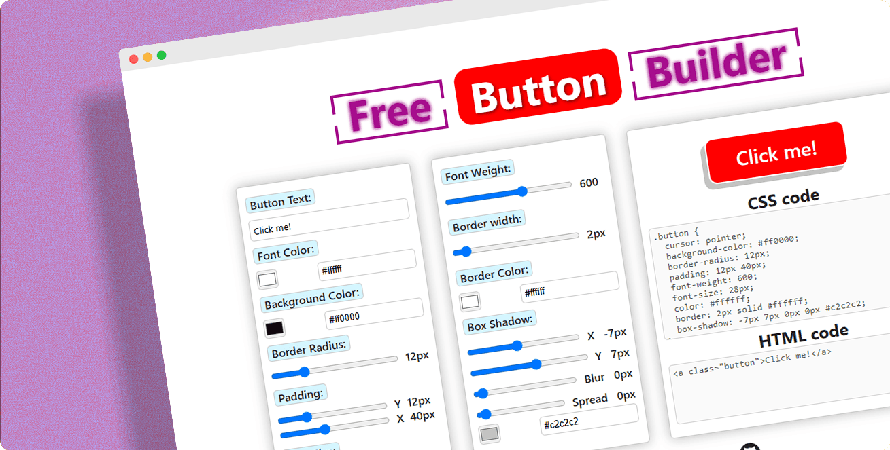

# Button Builder App

Free Button Builder is a web-based tool designed to help users visually create custom CSS buttons without writing any code. The interface is clean and intuitive, divided into three main panels:

- **Style Controls** – Users can adjust button text, font color, background color, border radius, padding (X and Y), font size, and more through sliders and color pickers.

- **Advanced Styling** – Options include font weight, border width and color, and box shadow settings (X, Y, blur, spread, and color), allowing for detailed button design.

- **Preview & Code** – A live preview of the button updates in real-time, and the corresponding CSS and HTML code is generated instantly for easy copying and integration.

Perfect for designers, developers, or beginners, this tool makes button creation simple, fast, and highly customizable.

  <a href="https://button-builder-app.netlify.app/" target="_blank">
   
  </a>

# 📗 Table of Contents

- [📖 About the project](#about-project)
  - [🛠 Built with](#built-with)
    - [Tech stack](#tech-stack)
    - [Key features](#key-features)
  - [🚀 Live demo](#live-demo)
- [💻 Getting started](#getting-started)
  - [Setup](#setup)
  - [Prerequisites](#prerequisites)
  - [Install](#install)
  - [Usage](#usage)
  - [Run tests](#run-tests)
  - [Deployment](#deployment)
- [👷 Author](#author)
- [🔭 Future features](#future-features)
- [🤝 Contributing](#contributing)
- [⭐️ Show your support](#support)
- [🙏 Acknowledgements](#acknowledgements)
- [📝 License](#license)

# 📖 About the project 

**Free Button Builder** is a responsive **React + TypeScript** web application that allows users to dynamically generate styled HTML buttons with real-time visual feedback. Built with Vite for fast development and hot module replacement, the app focuses on modularity, interactivity, and ease of customization. It employs a **centralized CSS file** (App.css) to maintain consistent styling across components, promoting reusability and simplifying design updates.

## 🛠 Built with 

### Tech stack 

  
Languages and technologies
 
  <ul>
    <li><a href="https://react.dev/">React.js</a></li>
    <li><a href="https://www.typescriptlang.org/">TypeScript</a></li>
    <li><a href="https://developer.mozilla.org/en-US/docs/Web/HTML">HTML</a></li>
    <li><a href="https://developer.mozilla.org/en-US/docs/Web/CSS">CSS</a></li>
    <li><a href="https://git-scm.com/">Git</a></li>
    <li><a href="https://vite.dev/">Vite</a></li>

  </ul>

### Key features 

- **[Real-Time Button Customization]**
- **[Auto-Generated CSS & HTML Code]**
- **[Responsive Design]**

(<a href="#readme-top">back to top</a>)

## 🚀 Live demo 

- [Live Demo Link](https://button-builder-app.netlify.app/)

(<a href="#readme-top">back to top</a>)

## 💻 Getting started 

To get a local copy up and running, follow these steps.

### Setup

Clone this repository to your desired folder:

`git clone` https://github.com/J-C-S-V/button-builder.git

### Install

`npm install`.

### Usage

`npm run dev`.

### Run tests

Tests will be added in the future.

### Deployment

You can deploy this project using:

- [Netlify](https://www.netlify.com/)

(<a href="#readme-top">back to top</a>)

## 👷‍♂️ Author 

👷‍♂️ **Juan Sanchez**

- GitHub: [Juan Sanchez](https://github.com/J-C-S-V)
- Twitter: [Juan Sanchez](https://twitter.com/juansan0)
- LinkedIn: [Juan Sanchez](https://www.linkedin.com/in/sanchez-juan-carlos)

(<a href="#readme-top">back to top</a>)

## 🔭 Future features 

- [ ] **[Hover effects]**
- [ ] **[Animations]**
- [ ] **[Responsive design]**

(<a href="#readme-top">back to top</a>)

## 🤝 Contributing 

Make the app better. Contributions, issues, and feature requests are welcome! 😀

Fork this repository and create a pull request to add your changes.

Feel free to check the [issues page](../../issues/).

(<a href="#readme-top">back to top</a>)

## ⭐️ Show your support 

If you get inspired by this project you can give it a star here on Github 🙌

<!-- 
(<a href="#readme-top">back to top</a>)
 -->

<!-- ## 🙏 Acknowledgments 

I would like to thank Reaper for providing the audio engine for this project 🚀 -->

(<a href="#readme-top">back to top</a>)

## 📝 License 

This project is [MIT](https://github.com/J-C-S-V/button-builder/blob/main/LICENSE) licensed.

(<a href="#readme-top">back to top</a>)

